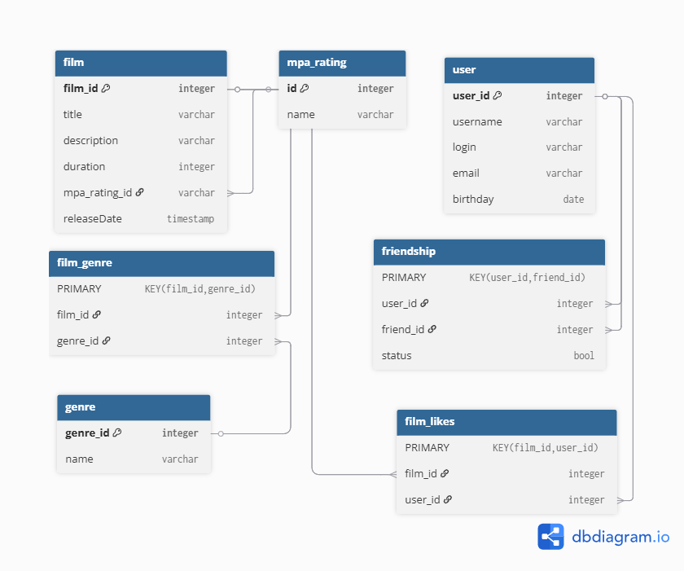

# java-filmorate
Template repository for Filmorate project.


## Примеры запросов к базе данных:
### Получение всех фильмов с указанием жанров:
```
SELECT f.title,
    g.name
FROM film AS f
INNER JOIN film_genre AS fg ON f.film_id = fg.film_id
INNER JOIN genre AS g ON g.genre_id = fg.genre_id;
```

### Получение логинов и имён всех пользователей:
```
SELECT username, 
    login
FROM user;
```

### Получение топ-10 самых популярных фильмов(название и количество лайков)
```
SELECT f.title,
    COUNT(fl.film_id) AS likes
FROM film AS f
INNER JOIN film_likes AS fl ON f.film_id = fl.film_id
GROUP BY t.title
ORDER BY likes DESC
LIMIT 10;
```


